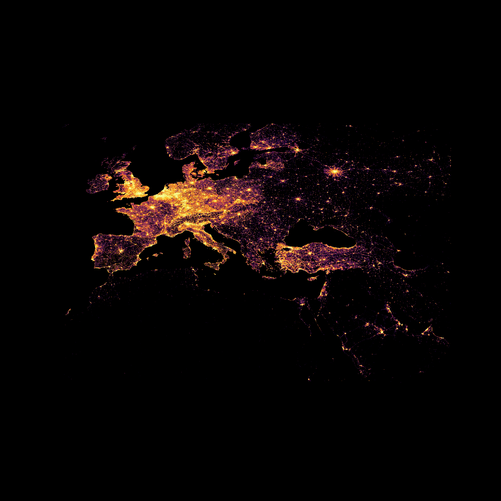

# Arrowshader

Arrow-based huge scatterplot library, inspired by datashader.

```python
import arrowshader as ash

c = ash.Canvas(width=600, height=600, x_range=..., y_range=...)
c.plot(your_dataset, "x_col_name", "y_col_name")
```

